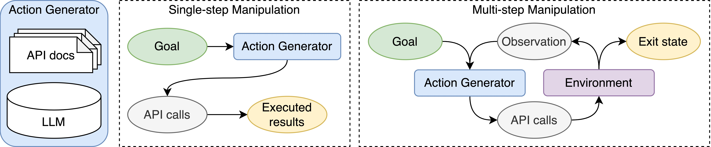

<a href="https://sambanova.ai/">
<picture>
  <source media="(prefers-color-scheme: dark)" srcset="/images/SambaNova-light-logo-1.png" height="60">
  
</picture>
</a>

# ToolBench
[](https://discord.gg/JehFG5HXKb)


Recent studies on software tool manipulation with large language models (LLMs) mostly rely on closed model APIs (e.g. OpenAI), as there is an significant gap of model accuracy between those closed models and all the rest open-source LLMs.
To study the root cause of the gap and further facilitate the development of open-source LLMs, especially their capabilities on tool manipulation, we create the ToolBench. 
The ToolBench is a benchmark consisting of diverse software tools for real-world tasks. 
We also provide easy-to-use infrastructure in this repository to directly evaluate the execution success rate of each model. 
Contributions to this repo are highly welcomed! We are excited to see new action generation algorithms and new testing tasks.


## Table of contents
- [Prerequisites](#prerequisites)
- [Installation](#installation)
- [Usage](#usage)
- [Tasks](#tasks)
- [Available Checkpoints](#checkpoints)

## Prerequisites 

### Credentials
- Create an [OpenAI account](https://platform.openai.com/account/api-keys) and register an API key.
- Follow [this guide](https://developers.google.com/workspace/guides/create-credentials#service-account) to create a Google Cloud service account and create credentials for the account. Enable Google Sheets API and Google Drive API for the credentials.
- Create an account for [OpenWeather](https://home.openweathermap.org/users/sign_up) and register an API key
- Register an API key for [The Cat API](https://thecatapi.com/signup)

After registration, update your credentials in `credential.sh` and 
```
source credential.sh
```

### Software
- [Conda](https://www.anaconda.com/) (anaconda)
- [Java](https://www.oracle.com/java/technologies/downloads/) >= 11.0.13

```
java -version
conda --version
```

## Installation

- Activate a virtual environment
```
conda create --prefix ./venv python=3.8.13
conda activate ./venv
```

- Download resources
```
sh download_resources.sh
```
Press Enter on all the questions. This process may take about 15 minutes.

- Installation
```
pip install -e .
```

- Make sure everything's good!
```
pytest tests
```

<details>

  <summary>Installation FAQ</summary>

- `Permission denied: '/tmp/tika.log'`
```
# If you are sharing your machine with someone else, please set
mkdir /tmp/$USER && export TIKA_LOG_PATH=/tmp/$USER
```

- Unable to find `libjvm.so`
```
export JAVA_HOME=
```
</details>

## Usage
This repository evaluates the API function call success rate on the following tools from the ToolBench:
1. [OpenWeather](https://openweathermap.org/api)
2. [The Cat API](https://thecatapi.com)
3. Home Search (similar to [Redfin](https://www.redfin.com/))
4. Trip Booking (similar to [booking.com](https://www.booking.com/))
5. [Google Sheet](https://docs.gspread.org/)
6. [VirtualHome](http://virtual-home.org/)
7. [Webshop](https://webshop-pnlp.github.io/)
8. [Tabletop](https://code-as-policies.github.io/)

One can kick off the evaluation job with `test.py` on any combination of tools, models, number of APIs 
to retrieve and number of demonstation examples to place in the prompt. Here is an example of evaluating 
`text-davinci-003` on `open_weather` task.
```
python test.py \
--task 'open_weather' --version 'v0' \
--top_k_api 10 --top_k_example 3 --num_test_samples -1 \
--client_name "openai" --model_name 'text-davinci-003' --max_output_token 128 
```
All the results will be logged out to the `--out_dir`, which defults to `out/`.
There will also be a cache created for each `client_name` and `model_name` combination as a sqlite database. When you want to query that given LM with a past query (prompt), it will retrieve the answer from the cache directly without running LM inference again.

More examples can be found below:
<details>

  <summary>Evaluation of OpenAI Models</summary>
    
```
python test.py --task 'open_weather' --version 'v0' --client_name "openai" --model_name 'text-davinci-003' --max_output_token 128 --top_k_api 10 --top_k_example 3 --num_test_samples -1
python test.py --task 'the_cat_api' --version 'v0' --client_name "openai" --model_name 'text-davinci-003' --max_output_token 128 --top_k_api 3 --top_k_example 3 --num_test_samples -1
python test.py --task 'virtual_home' --version 'v0' --client_name "openai" --model_name 'text-davinci-003' --max_output_token 128 --top_k_api 10 --top_k_example 3 --num_test_samples -1
python test.py --task 'home_search' --version 'v0' --client_name "openai" --model_name 'text-davinci-003' --max_output_token 128 --top_k_api 15 --top_k_example 3 --num_test_samples -1
python test.py --task 'booking' --version 'v0' --client_name "openai" --model_name 'text-davinci-003' --max_output_token 300 --top_k_api 15 --top_k_example 3 --num_test_samples -1
python test.py --task 'google_sheets' --version 'v0' --client_name "openai" --model_name 'text-davinci-003' --max_output_token 256 --top_k_api 0 --top_k_example 3 --num_test_samples -1
python test.py --task 'web_shop' --version 'v0' --client_name "openai" --model_name 'text-davinci-003' --max_output_token 128 --top_k_api 0 --top_k_example 3 --num_test_samples -1
python test.py --task 'web_shop' --version 'v1' --client_name "openai" --model_name 'text-davinci-003' --max_output_token 128 --top_k_api 0 --top_k_example 3 --num_test_samples -1
python test.py --task 'code_as_policies_tabletop' --version 'v0' --client_name "openai" --model_name 'text-davinci-003' --max_output_token 256 --top_k_api 0 --top_k_example 0 --num_test_samples -1
```
</details>

<details>

  <summary>Evaluation of HuggingFace Models Locally</summary>
    
- To host a model on a server, independent from this repo, follow [manifest](https://github.com/HazyResearch/manifest).
- Find the IP address + port in the output of the commands above, and plug them in to the following commands.
```
python test.py --task 'open_weather' --version 'v0' --client_name "huggingface" --model 'facebook/opt-iml-30b' --client_connection 'http://10.10.1.98:5000' --max_output_token 128 --top_k_api 10 --top_k_example 3 --num_test_samples -1
python test.py --task 'the_cat_api' --version 'v0' --client_name "huggingface" --model 'facebook/opt-iml-30b' --client_connection 'http://10.10.1.98:5000' --max_output_token 128 --top_k_api 3 --top_k_example 3 --num_test_samples -1
python test.py --task 'virtual_home' --version 'v0' --client_name "huggingface" --model 'facebook/opt-iml-30b' --client_connection 'http://10.10.1.98:5000' --max_output_token 128 --top_k_api 10 --top_k_example 3 --num_test_samples -1
python test.py --task 'home_search' --version 'v0' --client_name "huggingface" --model 'facebook/opt-iml-30b' --client_connection 'http://10.10.1.98:5000' --max_output_token 128 --top_k_api 15 --top_k_example 3 --num_test_samples -1
python test.py --task 'booking' --version 'v0' --client_name "huggingface" --model 'facebook/opt-iml-30b' --client_connection 'http://10.10.1.98:5000' --max_output_token 300 --top_k_api 15 --top_k_example 3 --num_test_samples -1
python test.py --task 'google_sheets' --version 'v0' --client_name "huggingface" --model 'facebook/opt-iml-30b' --client_connection 'http://10.10.1.98:5000' --max_output_token 256 --top_k_api 0 --top_k_example 3 --num_test_samples -1
python test.py --task 'web_shop' --version 'v0' --client_name "huggingface" --model 'facebook/opt-iml-30b' --client_connection 'http://10.10.1.98:5000' --max_output_token 128 --top_k_api 0 --top_k_example 3 --num_test_samples -1
python test.py --task 'web_shop' --version 'v1' --client_name "huggingface" --model 'facebook/opt-iml-30b' --client_connection 'http://10.10.1.98:5000' --max_output_token 128 --top_k_api 0 --top_k_example 3 --num_test_samples -1
python test.py --task 'code_as_policies_tabletop' --version 'v0' --client_name "huggingface" --model 'facebook/opt-iml-30b' --client_connection 'http://10.10.1.98:5000' --max_output_token 256 --top_k_api 0 --top_k_example 0 --num_test_samples -1
```
</details>

<details>

  <summary>Running FAQ</summary>
    
- If your job terminates with label assertion error: Rerun it.
</details>


## Tasks

### Test set structure
Each task in `data/` is organized in the following way.
```
$ tree <task>/<version>
<task>/<version>/
├── examples
│   ├── 0_0.txt
│   ├── 1_0.txt
│   ├── ...
│   ├── 8_0.txt
│   └── 9_0.txt
├── functions
│   ├── search
│   ├── select_home_type
│   ├── ...
│   ├── set_num_garages
│   └── set_num_swimming_pools
└── test.jsonl
```
- `<version>` is the version of the task.
- `examples/` folder contains the example use cases of the APIs. Each file contains a single Q&A pair, where the answer is in the executable code. You can place as many examples as you want in this folder.
- `functions` folder defines the set of API functions for this task. Each file contains the function signiture and a description.
- `test.jsonl` is a list of test cases. 
- Addtional files for either task context or evaluation can also be placed in the folder. 


### Examples

Here we list of a subset of the API docs as well as the examples of each ToolBench task.

<details>

  <summary>Open Weather</summary>

  - [API source](https://openweathermap.org/api)
  - API docs
  ```
  # Get the current air pollution data in location with latitude={lat}, longitude={lon}
  curl -X GET 'https://api.openweathermap.org/data/2.5/air_pollution?lat={lat}&lon={lon}&appid={API_KEY}'

  Parameters:
  lat, lon: (required) Geographical coordinates (latitude, longitude).
  appid: (required) Your unique API key.


  # Get the weather forecast data in location with latitude={lat}, longitude={lon}
  curl -X GET 'https://api.openweathermap.org/data/2.5/forecast?lat={lat}&lon={lon}&appid={API_KEY}{optional_params}'

  Parameters:
  lat, lon: (required) Geographical coordinates (latitude, longitude).
  appid: (required) Your unique API key.
  units: (optional) Units of measurement. 'standard' (default), 'metric' and 'imperial' units are available.
  mode: (optional) Response format. 'JSON' format is used by default. To get data in 'XML' format use mode=xml.
  lang: (optional) You can use the lang parameter to get the output in your language. 'en' for English (default); 'fr' for Franch; 'zh_cn' for simplified Chinese; 'it' for Italian; 'de' for German; 'ru' for Russian; 'ja' for Japanese; 'nl' for Dutch.
  ```
  - Examples
  ```
  Task: Do you know what's the weather like in the following days in 94957? Please give me a json-mode response in Dutch.
  Action:
  curl -X GET 'https://api.openweathermap.org/data/2.5/forecast?zip=94957&appid={API_KEY}&mode=json&lang=nl'


  Task: What's the current air pollution level at the location with longitute -107.6 and latitude -75.4?
  Action:
  curl -X GET 'https://api.openweathermap.org/data/2.5/air_pollution?lat=-75.4&lon=-107.6&appid={API_KEY}'
  ```
</details>


<details>

  <summary>The Cat API</summary>

  - [API source](https://thecatapi.com/)
  - API docs
  ```
  # Delete the image with id {image_id} from the list of favorites
  curl -X DELETE 'https://api.thecatapi.com/v1/favourites/{image_id}'

  # Add the image with id {image_id} to the list of favorites
  curl -X POST 'https://api.thecatapi.com/v1/favourites' --data '{"image_id":"{image_id}"}'

  # Get the list of favorite cat images.
  curl -X GET 'https://api.thecatapi.com/v1/favourites'
  ```
  - Examples
  ```
  Task: Remove the image tu from my favorites.
  Action:
  curl -X DELETE 'https://api.thecatapi.com/v1/favourites/tu'

  Task: List all my favorite cat images.
  Action:
  curl -X GET 'https://api.thecatapi.com/v1/favourites'

  Task: Vote up the image with id alp.
  Action:
  curl -X POST 'https://api.thecatapi.com/v1/votes' --data '{"image_id":"alp", "value":1}'
  ```
</details>


<details>

  <summary>Home Search</summary>

  - API docs
  ```
  # To set home types for search. For home buying, home_types choices are: "House", "Townhouse", "Condo", "Land", "Multi-family", "Mobile", "Co-op"; for home renting, home_types choices are: "House", "Townhouse", "Condo", "Apartment".
  API.select_home_type(home_types: List[str])

  # To specify whether to search homes for buying or renting. 'value' can be chosen from ['buy', 'rent']. This function must be called after setting the location and before setting any other criteria.
  API.set_buy_or_rent(value: str)

  # To set the maximum commute time in minite
  API.set_max_commute_time(value: int)

  # To set the minimum home price in dollars
  API.set_min_price(value: int)

  # To set the maximum home price in dollars
  API.set_max_price(value: int)

  # To set the minimum home size in square feet
  API.set_min_square_feet(value: int)

  # To set the maximum home size in square feet
  API.set_max_square_feet(value: int)

  # To set the number of balconies
  API.set_num_balconies(value: int)

  # To set the floor number
  API.set_floor_number(value: int)

  # To set the number of swimming pool(s)
  API.set_num_swimming_pools(value: int)

  # To set the number of garage(s)
  API.set_num_garages(value: int)

  # To set the number of bedroom(s)
  API.set_num_beds(value: int)

  # To set the number of bathroom(s)
  API.set_num_baths(value: float)

  # To set the location for the search area. This function must be called before setting any criteria.
  API.set_location(value: string)

  # Submit criterion to get search results. This function should be called after setting all the criterion.
  API.search()
  ```
  - Examples
  ```
  Task: I want to buy a townhouse, mobile or co-op in Pittsburgh with 4 rooms. My budget is $1385000.
  Actions:
  API.set_location("Pittsburgh")
  API.set_buy_or_rent("buy")
  API.select_home_type(["Townhouse", "Mobile", "Co-op"])
  API.set_num_beds(4)
  API.set_max_price(1385000)
  API.search()

  Task: Can you assist me in finding a co-op, townhouse or land in Aurora with 2 bedrooms, 1 bathrooms, 4 swimming pools, a price range of 118000 to 1464000, and a minimum square footage of 1300?
  Actions:
  API.set_location("Aurora")
  API.set_buy_or_rent("buy")
  API.select_home_type(["Co-op", "Townhouse", "Land"])
  API.set_num_beds(2)
  API.set_num_baths(1)
  API.set_num_swimming_pools(4)
  API.set_min_price(118000)
  API.set_max_price(1464000)
  API.set_min_square_feet(1300)
  API.search()

  Task: I'd like to rent a house, townhouse or apartment in Lincoln between 1150 and 3400 square feet, with 1 bedrooms, and a budget of $716000 to $1415000.
  Actions:
  API.set_location("Lincoln")
  API.set_buy_or_rent("rent")
  API.select_home_type(["House", "Townhouse", "Apartment"])
  API.set_min_square_feet(1150)
  API.set_max_square_feet(3400)
  API.set_num_beds(1)
  API.set_min_price(716000)
  API.set_max_price(1415000)
  API.search()
  ```
</details>


<details>

  <summary>Trip Booking</summary>

  - API docs
  ```
  # To select the transportation type from ['flight', 'train', 'bus', 'cruise'].
  API.select_transportation(transportation_type)

  # To select the booking type from ['hotels', 'trip tickets', 'both'].
  API.select_booking_type(booking_type)

  # To set the number of child tickets to purchase.
  API.set_num_children(value)

  # To set the number of adult tickets to purchase.
  API.set_num_adults(value)

  # To set the location for arrival, given a Loc object.
  API.set_destination(Loc)

  # To set the location for departure, given a Loc object.
  API.set_origin(Loc)

  # To set the location for hotel search, given a Loc object.
  API.set_hotel_location(Loc)

  # To select the hotel room type from ['King Bed', 'Queen Bed', 'Double', 'Luxury'].
  API.select_room_type(room_type)

  # To set the number of hotel rooms to book.
  API.set_num_rooms(value)

  # Submit criterion to get search results.
  API.search()
  ```
  - Examples
  ```
  I live in Laredo, and am planning a trip to Glendale. I need to book 5 adult round trip tickets for train and 1 hotel rooms for 5 nights. I'll leave and check in on 2023/08/25, and check out on 2023/08/30.
  Actions:
  API.select_booking_type("both")
  location_from = Loc("Laredo")
  API.set_origin(location_from)
  location_to = Loc("Glendale")
  API.set_destination(location_to)
  API.set_num_adults(5)
  API.select_transportation("train")
  API.set_num_rooms(1)
  checkin_date = Date(8, 25, 2023)
  API.set_checkin_date(checkin_date)
  checkout_date = Date(8, 30, 2023)
  API.set_checkout_date(checkout_date)
  hotel_location = Loc("Glendale")
  API.set_hotel_location(hotel_location)
  API.search()

  Could you help me find train tickets for 3 children and 5 adults from Des Moines to Cape Coral on July 07, 2022? My budget is up to 280 per ticket.
  Actions:
  API.select_booking_type("trip tickets")
  API.select_transportation("train")
  API.set_num_children(3)
  API.set_num_adults(5)
  location_from = Loc("Des Moines")
  API.set_origin(location_from)
  location_to = Loc("Cape Coral")
  API.set_destination(location_to)
  departure_date = Date(7, 7, 2022)
  API.set_departure_date(departure_date)
  API.set_max_ticket_price(280)
  API.search()
  ```
</details>


<details>

  <summary>Google Sheets</summary>

  - [API source](https://docs.gspread.org/)
  - We also encourage the model to utilize [pands dataframe](https://pandas.pydata.org/docs/reference/api/pandas.DataFrame.html) for advanced manipulations.
  - The test data can be [found here](https://docs.google.com/spreadsheets/d/1dgsg17hqRHkrJnKvWQyFwinMJNrsi1z2uhWNiJCUVIQ/edit?usp=sharing).

  - API docs
  ```
  # Sets values in a cell range of the sheet. 
  worksheet.update(range_name, values=None, **kwargs)

  # Updates the value of a cell. 
  worksheet.update_cell(row, col, value)

  # Deletes multiple columns from the worksheet at the specified index. 
  worksheet.delete_columns(start_index, end_index=None)

  # Deletes multiple rows from the worksheet at the specified index. 
  worksheet.delete_rows(start_index, end_index=None)
  ```
  - Examples
  ```
  | Product | Cost | Price |
  | beef | 1 | 3 |
  | pork | 5 | 4 |
  | chicken | 10 | 11 |
  | lamb | 3 | 15 |
  | duck | 12 | 2 |
  | fish | 2 | 100 |

  Task: Sets 'Hello world' in 'A2' cell
  Actions:
  worksheet.update('A2', 'Hello world')

  Task: Sets 'Hello world' in 'A2' cell
  Actions:
  worksheet.update_cell(2, 1, 'Hello world')

  Task: Updates A2 and A3 with values 42 and 43
  Actions:
  worksheet.update('A2:A3', [[42], [43]])

  Task: Updates D2 with values 3
  Actions:
  worksheet.update('D2', 3)

  Task: Sum A1:A4 and write the result below A4
  Actions:
  worksheet.update('A5', '=SUM(A1:A4)', raw=False)

  Task: Update chicken's price by 2
  Actions:
  df = get_as_dataframe(worksheet)
  df.loc[df['Product'] == 'chicken', 'Price'] += 2
  worksheet.clear()
  set_with_dataframe(worksheet, df, include_index=False, include_column_header=True)
  ```
</details>


<details>

  <summary>Virtual Home</summary>

  - API is inherited from [VirtualHome](http://virtual-home.org/)
  - Train/Test sets are from [this work](https://wenlong.page/language-planner/)

  - API docs
  ```
  # Take a piece of clothes off. 'object' can only be: ['clothes_jacket', 'clothes_dress', 'clothes_hat', 'shoes', 'clothes_shirt', 'clothes_pants'].
  Agent.TakeOff(object)

  # Scrub an object. 'object' can only be: ['mop', 'cup', 'toilet', 'plate', 'soap', 'sink', 'spoon', 'cat', 'shower', 'dishwasher', 'hands_both', 'drinking_glass', 'bowl', 'towel'].
  Agent.Scrub(object)

  # Rinse an object. 'object' can only be: ['cup', 'pot', 'water', 'water_glass', 'sponge', 'soap', 'towel', 'dish_soap', 'oven', 'cleaning_solution', 'knife', 'spoon', 'sink', 'faucet', 'clothes_underwear', 'detergent', 'drinking_glass', 'hands_both', 'toilet', 'shower', 'rag', 'plate', 'bowl', 'fork'].
  Agent.Rinse(object)

  # Wash an object. 'object' can only be: ['face', 'cup', 'food_vegetable', 'dresser', 'fork', 'shoes', 'child', 'coffee_cup', 'bed', 'water', 'soap', 'duster', 'brush', 'bathtub', 'toy', 'cleaning_bottle', 'hair', 'sink', 'razor', 'hands_both', 'drinking_glass', 'table', 'toilet', 'basket_for_clothes', 'shower', 'dishwasher', 'plate', 'bowl', 'spoon'].
  Agent.Wash(object)

  # Turn to an object. 'object' can only be: ['cup', 'coffee_pot', 'button', 'dresser', 'milk', 'phone', 'water', 'bed', 'soap', 'mail', 'picture', 'filing_cabinet', 'oven', 'faucet', 'newspaper', 'food_cheese', 'towel', 'spoon', 'laptop', 'man', 'food_bread', 'dishrack', 'keyboard', 'freezer', 'bookshelf', 'chair', 'water_glass', 'brush', 'centerpiece', 'desk', 'kitchen_cabinet', 'fly', 'toy', 'mouse', 'homework', 'computer', 'television', 'shower', 'plate', 'clothes_pants', 'child', 'food_dessert', 'folder', 'window', 'hair', 'coffee_maker', 'hanger', 'cat', 'food_food', 'floor_lamp', 'creditcard', 'razor', 'electrical_outlet', 'washing_machine', 'toilet', 'coffee_table', 'paper_towel', 'clothes_dress', 'couch', 'drawing', 'remote_control', 'face', 'food_vegetable', 'vacuum_cleaner', 'light', 'shoes', 'pot', 'mirror', 'duster', 'cleaning_bottle', 'sink', 'toaster', 'novel', 'clothes_shirt', 'table', 'kitchen_counter', 'wall_clock', 'woman', 'dishwasher', 'dog', 'check'].
  Agent.TurnTo(object)

  # Open an object. 'object' can only be: ['coffee_pot', 'dresser', 'freezer', 'bookshelf', 'cupboard', 'folder', 'mail', 'filing_cabinet', 'window', 'oven', 'desk', 'kitchen_cabinet', 'trashcan', 'coffee_maker', 'curtain', 'bathroom_cabinet', 'nightstand', 'bag', 'washing_machine', 'toilet', 'basket_for_clothes', 'microwave', 'dishwasher', 'purse'].
  Agent.Open(object)

  # Pull an object. 'object' can only be: ['table', 'mop', 'mouse', 'chair', 'clothes_pants', 'light_bulb', 'curtain', 'vacuum_cleaner', 'mat', 'cat', 'food_food', 'drawing', 'shoes', 'centerpiece', 'sheets', 'pot', 'laptop'].
  Agent.Pull(object)
  ```
  - Examples
  ```
  Task: Put down bags
  Actions:
  Agent.WalkTo(dining_room)
  Agent.WalkTo(food_food)
  Agent.Find(food_food)
  Agent.Grab(food_food)
  Agent.Find(table)
  Agent.Put(food_food, table)

  Task: Getting dresses
  Actions:
  Agent.WalkTo(bedroom)
  Agent.WalkTo(dresser)
  Agent.Find(dresser)
  Agent.WalkTo(dresser)
  Agent.Open(dresser)
  Agent.Find(clothes_pants)
  Agent.Grab(clothes_pants)
  Agent.PutOn(clothes_pants)
  Agent.Find(clothes_shirt)
  Agent.Grab(clothes_shirt)
  Agent.PutOn(clothes_shirt)
  Agent.Close(dresser)
  ```
</details>


<details>

  <summary>Webshop</summary>

  - API docs and train/test sets are from [this work](https://arxiv.org/pdf/2207.01206.pdf)

  - API docs
  ```
  # Go from any page to 'search' page
  click[back to search]

  # On the current 'item' page, click 'Buy Now' and end the episode
  click[buy now]# On the current 'item' page, click to view its description
  click[description]

  # On the current 'item' page, click to view its features
  click[features]

  # Go to the next page
  click[next >]

  # On the current 'item' page, select an option button
  click[{option}]

  # Go to the previous page
  click[< prev]

  # Go from the current 'results' page to an 'item' page that describes a product
  click[{product}]

  # On the current 'item' page, click to view its reviews
  click[reviews]

  # search a text query, and go from 'search' page to 'results' page that lists a set of products returned by a search engine
  search[{query}]
  ```
  - Examples
  ```
  Task:
  Amazon Shopping Game
  Instruction: 
  i need a high speed usb flash drive that is 32 gb, and price lower than 50.00 dollars
  [button] Search [button_]

  Action:
  search[32 gb high speed usb flash drive ]

  Task:
  Instruction:
  i need a high speed usb flash drive that is 32 gb, and price lower than 50.00 dollars
  [button] Back to Search [button_]
  Page 1 (Total results: 50)
  [button] Next > [button_]

  [button] B0845XPB49 [button_]
  SanDisk 32GB Ultra Luxe USB 3.1 Flash Drive (Bulk 2 Pack) 150MB/s Speed 32 GB Pendrive Works with Computer, Laptop (SDCZ74-032G-G46) Bundle with (1) Everything But Stromboli Lanyard
  $20.58

  [button] B085X5548B [button_]
  V7 32GB USB 3.1 Flash Drive - 32 GB - USB 3.1-120 MB/s Read Speed - Black
  $11.59

  [button] B08DQ22WFM [button_]
  SanDisk Ultra Luxe 32GB USB 3.1 Flash Drive (Bulk 5 Pack) Works with Computer, Laptop, 150MB/s 32 GB PenDrive High Speed All Metal (SDCZ74-032G-G46) Bundle with (2) Everything But Stromboli Lanyards
  $46.36

  Action:
  click[b085x5548b]
  ```
</details>

  
<details>

  <summary>Tabletop</summary>

  - API docs and train/test sets are from [this work](https://code-as-policies.github.io/)

  - API docs: there is no explicit API definition. All the functions and usages are covered by the examples.
  - Examples
  ```
  ##### High-level UI #####
  objects = ['yellow block', 'green block', 'yellow bowl', 'blue block', 'blue bowl', 'green bowl']
  # the yellow block on the yellow bowl.
  say('Ok - putting the yellow block on the yellow bowl')
  put_first_on_second('yellow block', 'yellow bowl')

  objects = ['yellow block', 'green block', 'yellow bowl', 'blue block', 'blue bowl', 'green bowl']
  # which block did you move.
  say('I moved the yellow block')

  objects = ['yellow block', 'green block', 'yellow bowl', 'blue block', 'blue bowl', 'green bowl']
  # move the green block to the top right corner.
  say('Got it - putting the green block on the top right corner')
  corner_pos = parse_position('top right corner')
  put_first_on_second('green block', corner_pos)

  ##### parse_obj_name #####
  bjects = ['blue block', 'cyan block', 'purple bowl', 'gray bowl', 'brown bowl', 'pink block', 'purple block']
  # the block closest to the purple bowl.
  block_names = ['blue block', 'cyan block', 'purple block']
  block_positions = get_obj_positions_np(block_names)
  closest_block_idx = get_closest_idx(points=block_positions, point=get_obj_pos('purple bowl'))
  closest_block_name = block_names[closest_block_idx]
  ret_val = closest_block_name

  objects = ['brown bowl', 'banana', 'brown block', 'apple', 'blue bowl', 'blue block']
  # the blocks.
  ret_val = ['brown block', 'blue block']
  objects = ['brown bowl', 'banana', 'brown block', 'apple', 'blue bowl', 'blue block']
  # the brown objects.
  ret_val = ['brown bowl', 'brown block']

  ##### parse_position #####
  # a 30cm horizontal line in the middle with 3 points.
  middle_pos = denormalize_xy([0.5, 0.5]) 
  start_pos = middle_pos + [-0.3/2, 0]
  end_pos = middle_pos + [0.3/2, 0]
  line = make_line(start=start_pos, end=end_pos)
  points = interpolate_pts_on_line(line=line, n=3)
  ret_val = points

  # a 20cm vertical line near the right with 4 points.
  middle_pos = denormalize_xy([1, 0.5]) 
  start_pos = middle_pos + [0, -0.2/2]
  end_pos = middle_pos + [0, 0.2/2]
  line = make_line(start=start_pos, end=end_pos)
  points = interpolate_pts_on_line(line=line, n=4)
  ret_val = points

  ##### parse_question #####
  objects = ['yellow bowl', 'blue block', 'yellow block', 'blue bowl', 'fruit', 'green block', 'black bowl']
  # is the blue block to the right of the yellow bowl?
  ret_val = get_obj_pos('blue block')[0] > get_obj_pos('yellow bowl')[0]

  objects = ['yellow bowl', 'blue block', 'yellow block', 'blue bowl', 'fruit', 'green block', 'black bowl']
  # how many yellow objects are there?
  yellow_object_names = parse_obj_name('the yellow objects', f'objects = {get_obj_names()}')
  ret_val = len(yellow_object_names)

  ##### helper functions #####
  # define function: total = get_total(xs=numbers).
  def get_total(xs):
      return np.sum(xs)

  # define function: y = eval_line(x, slope, y_intercept=0).
  def eval_line(x, slope, y_intercept):
      return x * slope + y_intercept
  ```
</details>

Here is an example prompt we sent into the model with API definition, demonstration examples and the query 
on the Open Weather.

<details>

  <summary>Prompt Example</summary>

```
I have the following set of API:

# Get the current air pollution data in location with latitude={lat}, longitude={lon}
curl -X GET 'https://api.openweathermap.org/data/2.5/air_pollution?lat={lat}&lon={lon}&appid={API_KEY}'

Parameters:
lat, lon: (required) Geographical coordinates (latitude, longitude).
appid: (required) Your unique API key.

# Get the forecast air pollution data in location with latitude={lat}, longitude={lon}
curl -X GET 'https://api.openweathermap.org/data/2.5/air_pollution/forecast?lat={lat}&lon={lon}&appid={API_KEY}'

Parameters:
lat, lon: (required) Geographical coordinates (latitude, longitude).
appid: (required) Your unique API key.

# Get the current weather data in location with latitude={lat}, longitude={lon}
curl -X GET 'https://api.openweathermap.org/data/2.5/weather?lat={lat}&lon={lon}&appid={API_KEY}{optional_params}'

Parameters:
lat, lon: (required) Geographical coordinates (latitude, longitude).
appid: (required) Your unique API key.
units: (optional) Units of measurement. 'standard' (default), 'metric' and 'imperial' units are available.
mode: (optional) Response format. 'JSON' format is used by default. To get data in 'XML' format use mode=xml.
lang: (optional) You can use the lang parameter to get the output in your language. 'en' for English (default); 'fr' for French; 'zh_cn' for simplified Chinese; 'it' for Italian; 'de' for German; 'ru' for Russian; 'ja' for Japanese; 'nl' for Dutch.

# Get the weather forecast data in location with latitude={lat}, longitude={lon}
curl -X GET 'https://api.openweathermap.org/data/2.5/forecast?lat={lat}&lon={lon}&appid={API_KEY}{optional_params}'

Parameters:
lat, lon: (required) Geographical coordinates (latitude, longitude).
appid: (required) Your unique API key.
units: (optional) Units of measurement. 'standard' (default), 'metric' and 'imperial' units are available.
mode: (optional) Response format. 'JSON' format is used by default. To get data in 'XML' format use mode=xml.
lang: (optional) You can use the lang parameter to get the output in your language. 'en' for English (default); 'fr' for French; 'zh_cn' for simplified Chinese; 'it' for Italian; 'de' for German; 'ru' for Russian; 'ja' for Japanese; 'nl' for Dutch.

# Get up to 'k' geographical coordinates of locations named 'city_name'
curl -X GET 'https://api.openweathermap.org/geo/1.0/direct?q={city_name}&limit={k}&appid={API_KEY}'

Parameters:
q: (required) City name.
appid: (required) Your unique API key.
limit: (optional) Number of the locations in the API response.

# Get the current weather data in {zipcode} area
curl -X GET 'https://api.openweathermap.org/data/2.5/weather?zip={zipcode}&appid={API_KEY}{optional_params}'

Parameters:
zip: (required) Zip code.
appid: (required) Your unique API key.
units: (optional) Units of measurement. 'standard' (default), 'metric' and 'imperial' units are available.
mode: (optional) Response format. 'JSON' format is used by default. To get data in 'XML' format use mode=xml.
lang: (optional) You can use the lang parameter to get the output in your language. 'en' for English (default); 'fr' for French; 'zh_cn' for simplified Chinese; 'it' for Italian; 'de' for German; 'ru' for Russian; 'ja' for Japanese; 'nl' for Dutch.

# Get the weather forecast data in {zipcode} area
curl -X GET 'https://api.openweathermap.org/data/2.5/forecast?zip={zipcode}&appid={API_KEY}{optional_params}'

Parameters:
zip: (required) Zip code.
appid: (required) Your unique API key.
units: (optional) Units of measurement. 'standard' (default), 'metric' and 'imperial' units are available.
mode: (optional) Response format. 'JSON' format is used by default. To get data in 'XML' format use mode=xml.
lang: (optional) You can use the lang parameter to get the output in your language. 'en' for English (default); 'fr' for French; 'zh_cn' for simplified Chinese; 'it' for Italian; 'de' for German; 'ru' for Russian; 'ja' for Japanese; 'nl' for Dutch.

# Get the weather forecast data in {city}
curl -X GET 'https://api.openweathermap.org/data/2.5/forecast?q={city_formatted}&appid={API_KEY}{optional_params}'

Parameters:
q: (required) City name.
appid: (required) Your unique API key.
units: (optional) Units of measurement. 'standard' (default), 'metric' and 'imperial' units are available.
mode: (optional) Response format. 'JSON' format is used by default. To get data in 'XML' format use mode=xml.
lang: (optional) You can use the lang parameter to get the output in your language. 'en' for English (default); 'fr' for French; 'zh_cn' for simplified Chinese; 'it' for Italian; 'de' for German; 'ru' for Russian; 'ja' for Japanese; 'nl' for Dutch.

# Get the current weather data in {city}
curl -X GET 'https://api.openweathermap.org/data/2.5/weather?q={city_formatted}&appid={API_KEY}{optional_params}'

Parameters:
q: (required) City name.
appid: (required) Your unique API key.
units: (optional) Units of measurement. 'standard' (default), 'metric' and 'imperial' units are available.
mode: (optional) Response format. 'JSON' format is used by default. To get data in 'XML' format use mode=xml.
lang: (optional) You can use the lang parameter to get the output in your language. 'en' for English (default); 'fr' for French; 'zh_cn' for simplified Chinese; 'it' for Italian; 'de' for German; 'ru' for Russian; 'ja' for Japanese; 'nl' for Dutch.

-------------
I have the following set of examples:

Task: Do you know what's the weather like in the following days in 94957? Please give me a json-mode response in Dutch.
Action:
curl -X GET 'https://api.openweathermap.org/data/2.5/forecast?zip=94957&appid={API_KEY}&mode=json&lang=nl'

Task: How's the air quality for the next few days at the place where longitute = -32.1 and latitude = -43.1?
Action:
curl -X GET 'https://api.openweathermap.org/data/2.5/air_pollution/forecast?lat=-43.1&lon=-32.1&appid={API_KEY}'

Task: Please give me the air quality data at longitute 163.3 and latitude -80.0 at this moment.
Action:
curl -X GET 'https://api.openweathermap.org/data/2.5/air_pollution?lat=-80.0&lon=163.3&appid={API_KEY}'

-------------
Task: Can you tell me what to expect on the air quality in the coming days at the location with (longitute, latitude) = (133.3, -56.7)?
Actions:
```
</details>


## Checkpoints
We release the 3 finetuned checkpoints we created in the paper
- [LLaMA-30b](https://huggingface.co/sambanovasystems/LLaMA-30b-toolbench)
- [StarCoder](https://huggingface.co/sambanovasystems/starcoder-toolbench)
- [CodeGen-16b-mono](https://huggingface.co/sambanovasystems/codegen-16B-mono-toolbench)

\[Note\] The checkpoints provided in this section is only for initial study purpose, 
we do not expect the checkpoints to perform well in other tool tasks. 
We highly encourage the community to contribute!


## Citation
```
@misc{xu2023tool,
      title={On the Tool Manipulation Capability of Open-source Large Language Models}, 
      author={Qiantong Xu and Fenglu Hong and Bo Li and Changran Hu and Zhengyu Chen and Jian Zhang},
      year={2023},
      eprint={2305.16504},
      archivePrefix={arXiv},
      primaryClass={cs.CL}
}
```

### Acknowledgement
We sincerely appreciate all the helpful discussions from Urmish Thakker, Tian Zhao, Raghu Prabhakar, Kaizhao Liang, Petro Junior Milan, 
Bowen Yang, Qinghua Li and Yaqi Zhang.

We also want to express our gratitude to the great works in the open sourced models. Especially the ones we rely heavily on in the paper
- [LLaMA: Open and Efficient Foundation Language Models](https://arxiv.org/abs/2302.13971)
- [CodeGen: An Open Large Language Model for Code with Multi-Turn Program Synthesis](https://arxiv.org/abs/2203.13474)
- [StarCoder: may the source be with you!](https://arxiv.org/abs/2305.06161)

There are also several other inspiring works about tool manipulation and benchmarking that we want to raise our thanks to
- [Tool Learning with Foundation Models](https://arxiv.org/abs/2304.08354)
- [API-Bank: A Benchmark for Tool-Augmented LLMs](https://arxiv.org/abs/2304.08244)
- [Gorilla: Large Language Model Connected with Massive APIs](https://arxiv.org/abs/2305.15334)
